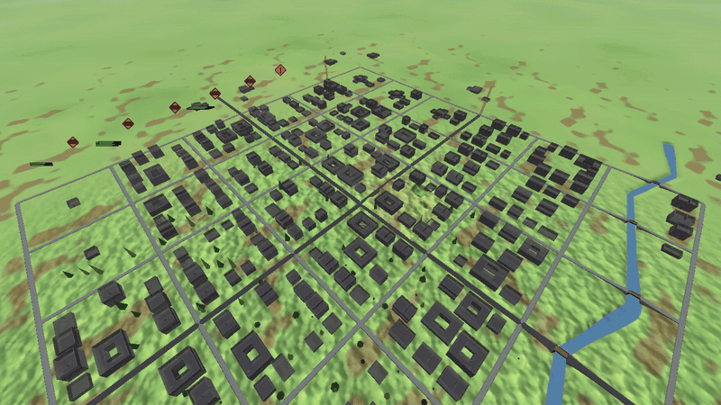
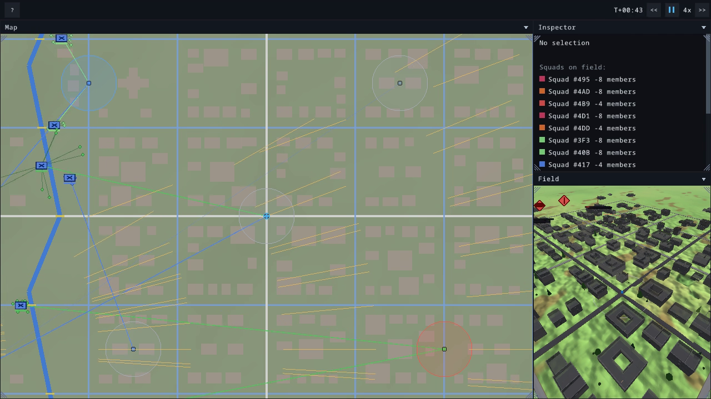
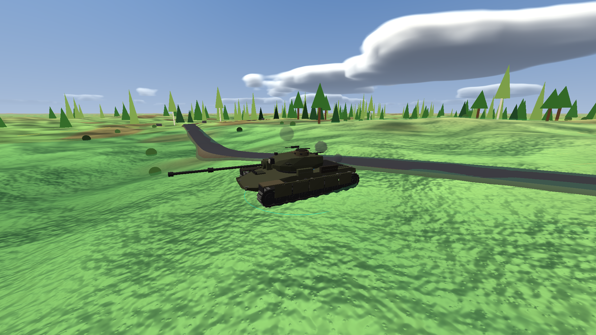

# project-rts

Учебный проект: попытка написать тактическую RTS на Go - без движка, руками.
Рендер и ввод - [raylib-go](https://github.com/gen2brain/raylib-go), сущности -
[Ark ECS](https://github.com/mlange-42/ark). Всё остальное: стриминг мира,
терраин, дороги, здания с этажами, навигация, сенсоры и туман войны, бой,
техника, авиация, поведение отделений, интерфейс,- написано самостоятельно, ~80 тысяч строк Go.



Это не игра и не продукт: цель - разобраться, как RTS устроена изнутри, и
проверить, насколько далеко одиночка может утащить такой проект, работая в
связке с агентами.

|  |  |
|---|---|
| Командная поверхность: карта, метки обеих сторон, маршруты, инспектор | Поле: низкополигональные модели, ленточные дороги, процедурный рельеф |

Больше клипов и стоп-кадров - в [`docs/media/CLIPS.md`](docs/media/CLIPS.md);
все они сняты встроенным рекордером с воспроизводимых сцен.

## Как это пишется

Код пишется агентами, и чтобы это работало, у проекта есть две вещи: **план** и
**проверяемый конец шага**.

Весь план лежит в [`.claude/`](.claude) и читается агентом как рабочий документ,
а не как описание для людей:

- [`.claude/lite/PLAN.md`](.claude/lite/PLAN.md) - блоки работ: что уже стоит,
  что делаем, по чему считаем закрытым;
- [`.claude/lite/GAME.md`](.claude/lite/GAME.md) и
  [`.claude/lite/MODEL.md`](.claude/lite/MODEL.md) - что это за игра и её числа;
- [`.claude/CLAUDE.md`](.claude/CLAUDE.md) - техника: сборка, порядок систем в
  тике, инварианты, паттерны Ark, гейты.

Конец шага подтверждает не взгляд на экран, а харнесс. В репозитории ~66
скриптованных сцен (`ai_*`, `lite_*`) и три гейта:

```bash
scripts/replay_gate.sh     # каждая сцена дважды: логи хешей побайтово равны
scripts/saveload_gate.sh   # загруженный прогон совпадает с непрерывным
scripts/mission_gate.sh    # каждая миссия дважды: тот же вердикт, те же хеши
```

Детерминизм здесь - не самоцель, а способ сказать агенту «сделано» машинно:
из плана он берёт, с чего шаг начинается, а зелёные гейты и вердикт сцены
говорят, что шаг закрыт и ничего соседнего не сдвинулось.

## Запуск

Нужны dev-библиотеки raylib (см. [требования
raylib-go](https://github.com/gen2brain/raylib-go#requirements)).

```bash
go run .                            # песочница: рельеф, здания, отряды, техника
go run . -mission=city              # миссия из missions/<name>.json
go run . -map=hills                 # карта из maps/<name>.json
go run . -scene=ai_bounding -watch  # посмотреть сцену стенда вместо headless-прогона
go build -o bin/rts .               # сборка всегда в bin/
```

## Послесловие

Идейно проект получился меньше задуманного, очень сказывается сложность работы в одиночку над крупным
проектом и отсутствие обратной связи. Часть осталась нереализованной, часть осталась в коде, но не
использована. В частности, сложное поведение баллистики, модели поведения юнитов, агентный ИИ
(несколько уровней контроля за юнитами в режиме реального времени), сочетание авиационной части,
наземной и морской, смена погоды и комплексное изменение ландшафта для нужд игрока. 